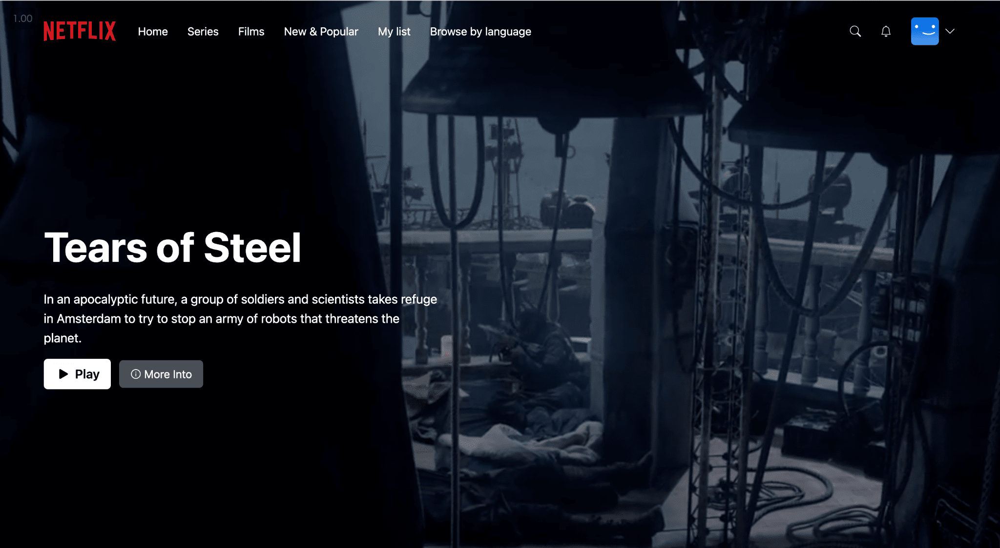
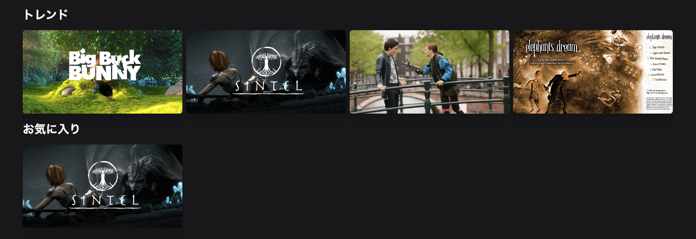
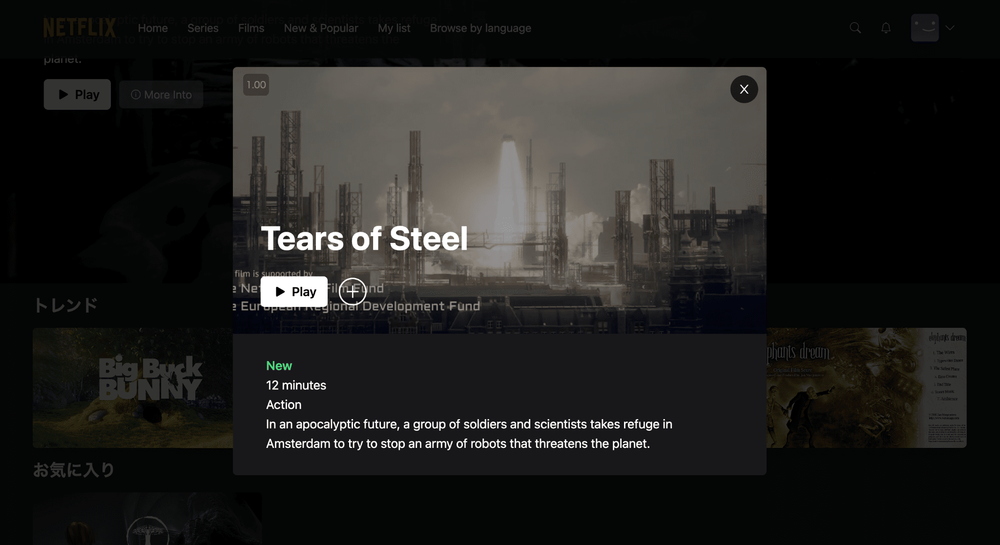

これは、React、NextJS、TailwindCSS＆Prismaを使用したFullStack Netflixクローンチュートリアルのリポジトリです。






## はじめに

最初に、開発用サーバーを起動します。

```bash
npm run dev
```

ブラウザで http://localhost:3000 を開くと結果が表示されます。

pages/index.tsxを編集することでページの編集を開始できます。ファイルを編集すると、ページは自動的に更新されます。

APIルートは、 http://localhost:3000/api/hello でアクセスできます。このエンドポイントは、 pages/api/hello.ts で編集できます。

pages/apiディレクトリは、Reactページの代わりにAPIルートとして扱われるため、/api/*にマップされます。

このプロジェクトでは、カスタムGoogleフォントであるInterを自動的に最適化およびロードするためにnext/fontを使用しています。

## 使用言語

- [React]
- [TailwindCSS]
- [Next.JS]
- [Prisma]
- [MongoDB]
- [NextAuth]

特徴：

- 環境、Typescript、NextJSセットアップ
- MongoDB＆Prisma接続、データベース作成
- NextAuthを使用した認証、Google＆Githubログイン
- すべてのページでの完全なレスポンシブ対応
- Cookieベースの認証
- APIおよびコントローラーの作成
- TailwindCSSを使用した細かいエフェクトとアニメーション
- React SWRデータ取得
- Zustand状態管理

前提条件
・Nodeバージョン14.x

## .envファイルの設定

DATABASE_URL=
GOOGLE_CLIENT_ID=
GOOGLE_CLIENT_SECRET=
GITHUB_ID=
GITHUB_SECRET=
NEXTAUTH_JWT_SECRET=
NEXTAUTH_SECRET=